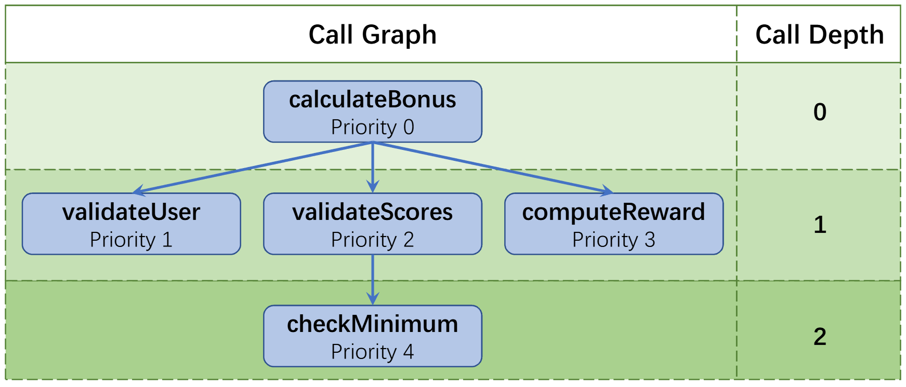

# CRAFT
The replication package of CRAFT(Call gRAph For Testing) approach.

## Structure
```text
CRAFT/
├── appraoch/
    ├── extractor
    └── generator/
        ├── BaseGen (generate test by metadata.)
        └── GuidedGen (generate test by extracted specification.)
└── dataset/
    ├── data
    └── metadata
└── experiment_result/
    ├── rq1_overall_perfromance
    └── rq2_abaltion_study
└── tmp/
    ├── metadata_class_repo (class-level metadata extracted by extractor.)
    ├── metadata_method_repo (method-level metadata extracted by extractor.)
    ├── project_repo (oringial project.)
    ├── spec_repo (specification extracted by generator/GuidedGen.)
    └── test_result (test generated by generator/BaseGen & generator/GuidedGen.)
```

## 🚀 Quick Start
### Step 1: Environment & Project Setup
1. **Save the Target Project:** Ensure the project you want to analyze is placed in the `./tmp/project_repo/` directory.
2. **Build Tree-sitter Java Grammar:**
   * Download Tree-sitter.
   ```bash
   git clone https://github.com/tree-sitter/tree-sitter-java.git
   ```
   
   * Compile the Java grammar into `java-grammar.so`.
   ```bash
   gcc -shared -o java-grammar.so -fPIC tree-sitter-java/src/parser.c
   ```
   * Save the compiled `java-grammar.so` at `./approach/extractor/java-grammar.so`.
3. **Install the VS Code Extension:**
   * Search for and install `get-call-return-definition-position` in the VS Code Marketplace.
   * Activate the extension: Open any `.java` file in the target project, click on any method, and run the command `>Get Call Return Definition Position` from the Command Palette (`Ctrl+Shift+P` or `Cmd+Shift+P`).
4. **Configure LLM Parameters:**
   * Update the required LLM configuration (`base_url`, `api_key`, `model`, and `java_version`) in the respective `test_prompt` and `spec_prompt` files located in the generator directories.

### Step 2: Extract Metadata (Extractor)
The first phase extracts class-level and method-level metadata and constructs the call graph for the focal class.

```bash
cd ./approach/extractor/

python main.py \
  --project_name example-project \
  --project_repo_path ../../tmp/project_repo/ \
  --metadata_method_repo_path ../../tmp/metadata_method_repo/ \
  --metadata_class_repo_path ../../tmp/metadata_class_repo/ \
  --focal_class_path /src/main/java/com/example/BonusCalculator.java \
  --test_class_path /src/test/java/com/example/BonusCalculatorTest.java
```

### Step 3: Generate Tests (Generator)
BaseGen Strategy: generate test by extracted metadata.
```bash
cd ./approach/generator/BaseGen/

python gen_test.py \
  --project_name example-project \
  --class_name BonusCalculator \
  --metadata_method_repo_path ../../../tmp/metadata_method_repo/ \
  --metadata_class_repo_path ../../../tmp/metadata_class_repo/ \
  --test_result_path ../../../tmp/test_result/
```

GuidedGen Strategy: generate test by extracted specification.
```bash
cd ./approach/generator/GuidedGen/

python gen_spec.py \
  --project_name example-project \
  --class_name BonusCalculator \
  --metadata_method_repo_path ../../../tmp/metadata_method_repo/ \
  --metadata_class_repo_path ../../../tmp/metadata_class_repo/ \
  --spec_repo_path ../../../tmp/spec_repo/

python gen_test.py \
  --project_name example-project \
  --class_name BonusCalculator \
  --spec_repo_path ../../../tmp/spec_repo/ \
  --metadata_class_repo_path ../../../tmp/metadata_class_repo/ \
  --test_result_path ../../../tmp/test_result/
```

## Example-Project
The `example-project` in `./tmp/project_repo/example-project`.

The `BonusCalculator` class.

### Project Structure
```text
example-project/
├── pom.xml
└── src/
    ├── main/java/com/example/BonusCalculator.java   (Focal Class)
    └── test/java/com/example/BonusCalculatorTest.java (Test Class)
 ```
    
### Focal Class - BonusCalculator
The `BonusCalculator` consists of 5 methods spanning 3 levels of call depth.

The diagram below illustrates the hierarchical class structure:



### Method Details

`calculateBonus` Entry method, calculates a bonus for a user based on two scores (`scoreA` and `scoreB`).

`validateUser` String contract, validates the format of a user ID to ensure it meets specific criteria (non-null and starts with \"USR-\").

`validateScores` Number contract, validates that the sum of two scores (`scoreA` and `scoreB`) equals 100 and checks if `scoreA` meets a minimum requirement of 50.

`computeReward` Core computational logic, computes a reward based on two input scores, where the first score is doubled and then added to the second score.

`checkMinimum` Boundary conditions, checks if the input score meets a minimum requirement of 50.